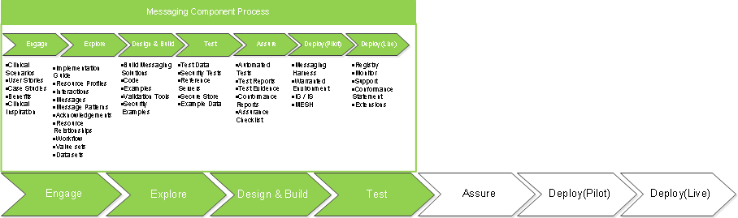
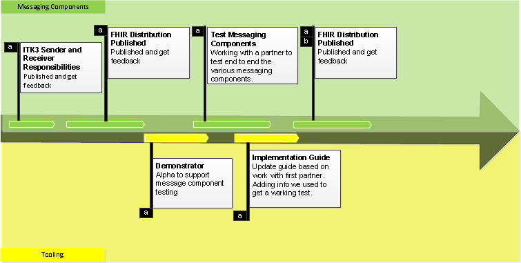





# Introduction #

"ITK Distribution" is the term used for a set for generic FHIR messaging components. These messaging components have been developed by NHS Digital to allow a standard approach to FHIR message headers and acknowledgements across NHS message flows in England. The clinical payloads are not specified within this site as these components can carry any payload. These components form along with NHS Digital FHIR Message and FHIR Document specifications are part of the ITK 3.0 solution.
   
FHIR Messaging components specified within this site have been developed by NHS Digital and use CareConnect profiles created in collaboration with the INTEROPen community. 

The INTEROPen vision is to create a library of nationally defined HL7® FHIR® resources and interaction patterns that implementers can adopt to simplify integration and interoperability within UK health and social care.

Find out more on the [INTEROPen website](http://interopen.org/).

# Using this guide #

This guide has been created to support the adoption of NHS Digital defined FHIR Messages. As such the site is structured around stakeholders involved in building FHIR messaging solutions including  messaging solution users, developers and architects.  



The above steps outline a complete journey from imagination and exploring to developing local messaging solutions using NHS Digital Messages, all the way to deploying a live messaging solution.

# ITK Distribution Focus #

The current site focuses on a typical FHIR messaging solution Developer's Journey as highlighted by the green boxes below in the developer journey:

# Resource Roadmap #

The [ITK Distribution journey](overview_message_journey.html) outlines the development roadmap for FHIR Messaging using the ITK Distribution component outlined messaging within this site. Note: This roadmap would include components from other NHS Digital specifications for example Transfer OF Care Document Profiles, CareConnect profiles etc.

The above roadmap illustrates the steps necessary to create, test and verify the messaging components as well as some of the supporting tooling which might be necessary to build to provide viable messaging solutions. The roadmap is not intended to be complete but to promote discussion, extension and engagement from interested parties.

